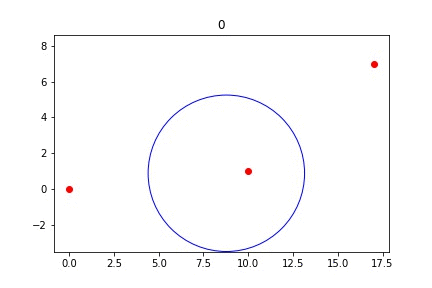
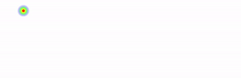

# Crowd Density Estimation System

🥇 Winner [HackEd 2019](https://hacked2019.devpost.com/)

We provide analytics for the physical world. We built an API to provide data on how people physically move and interact in your spaces.
Almost everyone has a mobile phone in their pockets these days. What if we could use the publically available information from these devices to estimate the number of people in a certain area?

Our plug and play WiFi beacons constantly monitor all probing packets sent by devices around them. We can use this information to track the flow of people.

With multiple beacons and a probabilistic model we can triangulate people as they move through your spaces.

We build realtime density maps of the environment to allow better analysis of traffic flow. The following GIF shows the flow of students at HackEd 2019.

Since we only look at MAC addresses it allows us to maintain customer privacy. With this versitile API resturants and bars to build dynamic wait time systems; it lets city planners better understand streets and crowds; it can help stores better understand how customers interact with their spaces.

