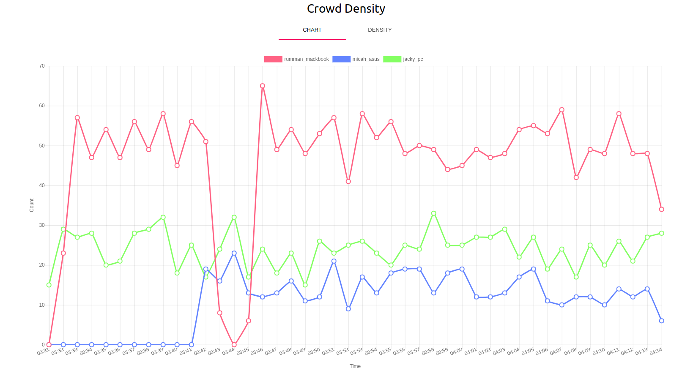

# Crowd Density Estimation System

Almost everyone has a mobile phone with them these days. 
What if we could use these devices to estimate the number of people in a certain area? 
This could allow businesses and city planners to make data-driven decisions.

Our simple API allows businesses to monitor flow of customers. 

Using multiple base stations we can triangulate customers interactions as they move through your spaces.

We build realtime density maps of the environment to allow better analysis of traffic flow.

